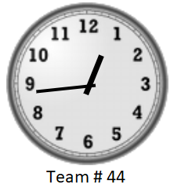

<!-- Source: https://github.com/othneildrew/Best-README-Template/pull/73 -->

<!-- PROJECT SHIELDS -->
<!--
*** I'm using markdown "reference style" links for readability.
*** Reference links are enclosed in brackets [ ] instead of parentheses ( ).
*** See the bottom of this document for the declaration of the reference variables
*** for contributors-url, forks-url, etc. This is an optional, concise syntax you may use.
*** https://www.markdownguide.org/basic-syntax/#reference-style-links
-->

<!-- PROJECT LOGO -->
 

  

  <h3 align="center">Team 44</h3>

  

    The 2022-2023 IMI BIGDataAIHUB Case Competition
     
    <a href="https://github.com/knamdar/IMI_BIGDataAIHUB/tree/master/documents"><strong>Explore the docs »</strong></a>
     
     
  

<!-- TABLE OF CONTENTS -->

  
Table of Contents

  <ol>
    <li>
      <a href="#the-team">The Team</a>
    </li>
    <li>
      <a href="#getting-started">Getting Started</a>
    </li>
    <li><a href="#license">License</a></li>
    <li><a href="#contact">Contact</a></li>
    <li><a href="#acknowledgments">Acknowledgments</a></li>
  </ol>

<!-- ABOUT THE PROJECT -->
## The Team

* Jay Yoo
* Ashima Singhal
* Manas Joshi
* Akash Kothari
* Safwat Khan
* Ernest (Khashayar) Namdar

(<a href="#readme-top">back to top</a>)

### Built With

![PyTorch][pytoch]

![scikit-learn][scikit-learn-url]

(<a href="#readme-top">back to top</a>)

<!-- GETTING STARTED -->
## Getting Started

The pipeline was developed with a modular design approach. We put codes, inputs, and results of each module in a separate directory, illustrated in the following image:

![Product Name Screen Shot][product-screenshot]

1. task1_score: adding QUERY_RISK to the features for each customer based on the similarity of BERT embeddings of their name and birth date to the entries of OpenData dataset
2. task1_identify: deriving the list of bad actors based on two different approachs: 
    + v1) using QUERY_RISK and a DecisionTree that is trained to predict RISK 
    + v2) matching name and birth date of the customers to OpenData entries
3. task1_identify_overlap: checking whether v1 and v2 bad actors would overlap
4. task2_A: Using the features (with and without QUERY_RISK) to predict the RISK with XGBoost and CatBoost models
5. task2_B: Using the features (with and without QUERY_RISK) to identify the Bad Actors with XGBoost and CatBoost models
6. task3_preprocessing: combining the node and edge data to be used by GCNs
7. task3_A: Using the preprocessed node and edge data to predict the RISK with GCNs
8. task3_B: Using the preprocessed node and edge data to identify the Bad Actors with GCNs
9. Bonus_MeasuringRandomness: Going back to task2 and stusying the effect of model initialization and data split on its generalizability
10. Bonus_MultiProcessing: Accelerating the pipeline using Multi-processing

P.S.
11. Bonus_EDA: Exploratory Data Analysis for tasks 2 and 3
12. Bonus_task2_VAE: Exploring the potential of VAEs for task2_A

<!-- LICENSE -->
## License

Distributed under the MIT License. See `LICENSE.txt` for more information.

(<a href="#readme-top">back to top</a>)

<!-- CONTACT -->
## Contact

Ernest Namdar - [@LinkedIn](https://www.linkedin.com/in/ernest-namdar/) - ernest.namdar@utoronto.ca

Project Link: [https://github.com/knamdar/IMI_BIGDataAIHUB](https://github.com/knamdar/IMI_BIGDataAIHUB)

(<a href="#readme-top">back to top</a>)

<!-- ACKNOWLEDGMENTS -->
## Acknowledgments

Use this space to list resources you find helpful and would like to give credit to. I've included a few of my favorites to kick things off!

* [Faiss, a library for efficient similarity search and clustering of dense vectors](https://github.com/facebookresearch/faiss)
* [NVIDIA DLI Course: Introduction to Graph Neural Networks](https://courses.nvidia.com/courses/course-v1:DLI+S-FX-05+V1/)
* [Plotting Confusion Matrix](https://github.com/DTrimarchi10/confusion_matrix/)
* [Creating the README](https://github.com/othneildrew/Best-README-Template)

(<a href="#readme-top">back to top</a>)

<!-- MARKDOWN LINKS & IMAGES -->
<!-- https://www.markdownguide.org/basic-syntax/#reference-style-links -->

[product-screenshot]: images/screenshot.png
[pytoch-url]: https://pytorch.org
[pytoch]: https://img.shields.io/badge/PyTorch-%23EE4C2C.svg?style=for-the-badge&logo=PyTorch&logoColor=white
[scikit-learn-url]: https://scikit-learn.org
[scikit-learn]: https://img.shields.io/badge/scikit--learn-%23F7931E.svg?style=for-the-badge&logo=scikit-learn&logoColor=white
